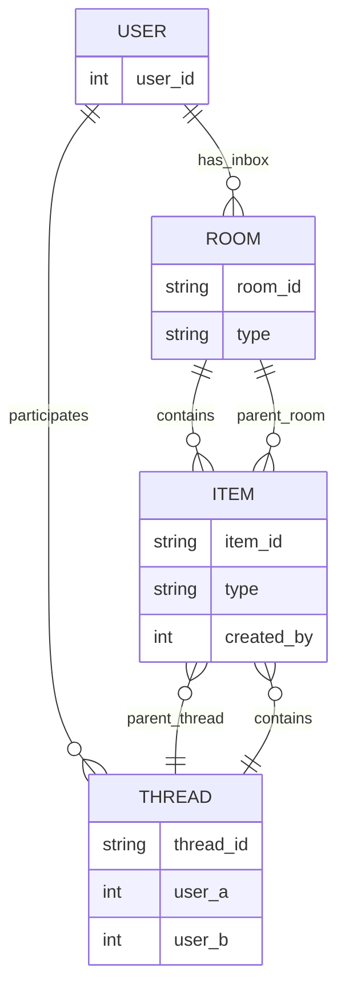
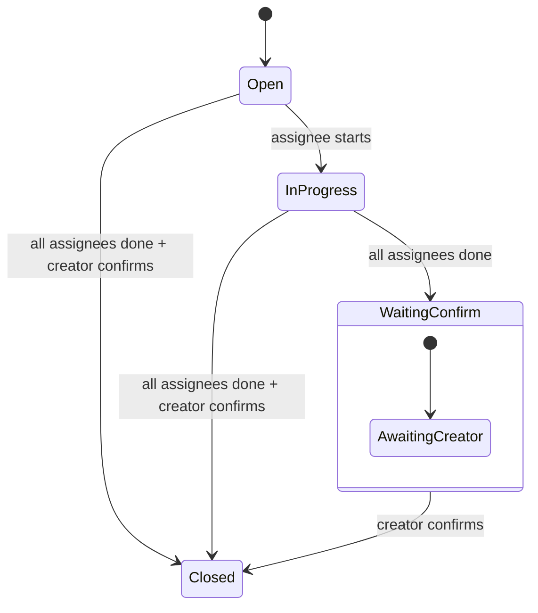

# PWA Chat Panel – Badges/Avatars pre žiadosti + Profil vlákna + Filter + Soft/Hard delete

## Cieľ
Rozšíriť PWA chat panel tak, aby:
1) v paneli zobrazoval **“badge” kruhy** (avatar/icon v kruhu) pre každú osobu, ktorá má voči mne:
   - novú žiadosť / úlohu / požiadavku / pozvánku,
   - alebo prebiehajúce spojenie,
   - alebo neprečítané správy,
2) farba pozadia badge (kruh) signalizovala **typ/urgentnosť stavu**,
3) klik na badge otvoril **detail osoby** (profil/kontext), kde vidím:
   - všetky komunikácie (správy),
   - úlohy,
   - požiadavky,
   - systémové udalosti (napr. “request connect”),
4) detail má filter: “všetko” alebo len konkrétny typ,
5) v detaile aj v zoznamoch musí byť možnosť:
   - soft delete (skryť pre mňa),
   - hard delete (trvalé zmazanie, iba ak mám právo; inak fallback soft),
6) UI je MVP, no dátový model musí byť pripravený na rozšírenie.

---

## Pojmy a dátové objekty (MVP)
### Terminológia a pravidlá: Thread vs Room
- **Room** = skupinový kanál (shared rooms).
- **Thread** = 1:1 kontext (direct thread) medzi dvoma používateľmi.
- Pravidlá:
  - Každý používateľ má personal inbox room `inbox:{user_id}` pre systémové notifikácie a "pre mňa".
  - Priame správy medzi A a B idú do direct thread `dm:{min(A,B)}:{max(A,B)}` (deterministický identifikátor).
  - Shared rooms sú separátne (napr. `room:{slug}`).
- Badges sa počítajú nad:
  - direct threads + inbox pre mňa,
  - shared rooms voliteľne (sekundárne).

### Entity: Participant (osoba)
- `user_id` (int)
- `display_name`
- `avatar_url` (optional)
- `role` (optional)

### Entity: Thread (kontext s osobou)
Jedno “vlákno” pre dvojicu (ja + osoba). Nemiešať s miestnosťou.
- `thread_id` (string/int)
- `peer_user_id` (int) – osoba na druhej strane
- `last_activity_at` (datetime)
- `unread_count` (int)
- `badge_state` (enum) – vypočítaný stav pre farbu badge

### Entity: Item (jednotná položka v detaile)
MVP zaviesť jednotný event stream s typom:
- `item_id`
- `type` enum: `message | request | task | note | system`
- `subtype` string (optional): napr. `connect_request`, `order_issue`, `call_me`
- `title` / `text`
- `status` enum: `open | in_progress | done | archived` (pre task/request), pre message implicit
- `priority` enum: `low | normal | high | urgent`
- `created_at`, `updated_at`
- `created_by` (user_id)
- `thread_id` XOR `room_id`
- `room_id`
- `deleted_by_me_at` (nullable datetime)  // soft delete pre mňa
- `deleted_hard_at` (nullable datetime)   // hard delete (admin/owner only)

Poznámka: pre MVP môže byť `message` existujúca tabuľka/endpoint, ale v PWA sa to má prezentovať jednotne (zjednotená DTO odpoveď).

### Relationship diagram (User / Thread / Room / Item)


---

## Badge signalizácia – stav a farby (konfigurácia)
Zaviesť mapu “badge state” -> farba/ikonka.

### Badge state (priorita vyhodnocovania)
1. `for_me_urgent` – udalosť v mojom inbox/dm, urgent/termín (červená)
2. `for_me` – neprečítané v mojom inbox/dm bez urgent (červená)
3. `urgent_request` – urgent požiadavka/úloha (priority=urgent, status=open)
4. `pending_request` – nová žiadosť/úloha (open) bez urgent
5. `unread_messages` – neprečítané správy
6. `active_connection` – prebiehajúce spojenie / “online session” (voliteľné, ak máte)
7. `idle` – bez stavu (badge sa nezobrazuje)

### UI pravidlá
- Badge je kruh (avatar / fallback ikonka).
- Ak je `idle`, badge sa v paneli nezobrazuje (alebo je v sekcii “ostatní” – voliteľné).
- V kruhu zobraziť:
  - avatar, alebo iniciály, alebo ikonku typu (napr. task)
- Malý “dot” indikátor (optional) v rohu môže zobrazovať `unread_count > 0`.

### Farby (navrhnúť CSS tokeny, nie hard-coded)
- urgent_request -> `--badge-urgent`
- pending_request -> `--badge-pending`
- unread_messages -> `--badge-unread`
- active_connection -> `--badge-active`

---

## UI – Chat Panel (ľavý panel / horný panel podľa vašej PWA)
### Komponenty
1) `BadgeBar` (horizontálny pás alebo grid kruhov)
   - zoznam badge pre všetky threads s `badge_state != idle`
   - klik na badge -> navigate na `ThreadDetail(peer_user_id|thread_id)`
2) existujúci chat panel ostáva (rooms/messages), ale doplniť hore `BadgeBar`

### Onboarding + admin approval queue (MVP)
- Pri prvom spustení PWA musí používateľ zadať `nickname` (povinné).
- PWA odošle `nickname` spolu s registráciou zariadenia do approval queue.
- Admin v plugine vidí **frontu schválení** s nickname + device_id a vie spraviť:
  - `approve` (aktivuje chat),
  - `deny` (zamietne),
  - `wait` (ponechá v pending),
  - `disconnect` (odpojí),
  - `remove from chat` (odstráni z chatu, ak treba).
- Po schválení sa `nickname` zobrazuje v PWA namiesto generického “Prihlásený”.
- Pri novej žiadosti admin dostane vizuálny + zvukový signal (viac v sekcii Signalizácia).

### Onboarding request-access + admin approval queue (API + UI)
- POST `/auth/request-access`
  - input: `X-Device-Id`, `nickname`
  - output: `status=pending`, `approval_code`, `expires_at`
- GET `/admin/access-requests` (list pending/wait/denied/expired)
- POST `/admin/access-requests/{id}/approve` (assign/create user, device active, chat identity)
- POST `/admin/access-requests/{id}/deny`
- POST `/admin/users/{user_id}/disconnect` (revoke sessions, device->revoked)

### Admin obrazovka – Chat → Žiadosti o prístup
- Tabuľka + akcie `approve/deny/wait`.
- Požiadavka musí obsahovať `nickname`, čas, `device_id` (skrátene).

### Flow diagram: onboarding + admin approval
```mermaid
flowchart TD
  A[PWA: POST /auth/request-access] --> B[status=pending + approval_code]
  B --> C[Admin: GET /admin/access-requests]
  C --> D{Decision}
  D -->|approve| E[POST /admin/access-requests/{id}/approve]
  D -->|deny| F[POST /admin/access-requests/{id}/deny]
  D -->|wait| C
  E --> G[Device status=active + chat identity]
  F --> H[status=denied]
  G --> I[PWA access granted]
```

### Interakcie
- Klik badge:
  - nastav “active peer”
  - otvor detail (route/view)
- Long-press / context menu (optional):
  - “Mute/Hide” (soft delete thread pre mňa) – voliteľné

---

## UI – Thread Detail (profil/kontext osoby)
### Route
- `/thread/:thread_id` alebo `/peer/:peer_user_id` (preferované: thread_id)

### Layout
- Header:
  - avatar + meno + stav (online optional)
  - quick actions: `Filter`, `Soft delete`, `Hard delete` (podľa práv)
- Body:
  - Tabs alebo filter pill:
    - `All | Messages | Requests | Tasks | System`
  - List položiek (ItemList) s grouped day headers (optional)
- Footer:
  - Compose box pre message (existing)
  - Quick create: `+ Task`, `+ Request` (optional MVP)

### Filter
- client-side filter podľa `type`
- server-side parametre (preferované) kvôli výkonu:
  - `type=message|request|task|system`
  - `status=open|done|...`
  - `include_deleted=false` default

### 1:1 workflow “Hotovo” (pre komunikáciu aj úlohy)
- 1:1 komunikácia zostáva “otvorená”, kým **obaja účastníci** nedajú `Hotovo`.
- Pre úlohy/požiadavky:
  - riešiteľ nastaví `done` (Hotovo),
  - zadávateľ musí potvrdiť “Potvrdené” (finálne uzavretie),
  - až potom sa item považuje za uzavretý pre obe strany.
- Badge “pre mňa” má prednosť pred ostatnými (napr. červený stav).

### Úlohy/požiadavky: dátový model + Hotovo consensus
- Model itemu (task/request):
  - `item_id`, `type=task|request`, `created_by`, `assignees[]`, `due_at`, `priority`, `status`
  - confirmations map:
    - `done_by[user_id]=timestamp`
    - `confirmed_by_creator_at` (timestamp) alebo `done_by` zahŕňa aj creator
- Pravidlá:
  - item je `closed/done` až keď:
    - všetci `assignees` dali Hotovo
    - a creator potvrdil Hotovo (finálne)
  - 1:1 komunikácia:
    - thread má closure per user: `closed_by[user_id]=timestamp`
    - thread je closed až keď sú tam obaja účastníci

### State diagram: task/request + Hotovo consensus


---

## Delete – požiadavky (soft/hard)
### Soft delete (pre mňa)
- skryje item/thread pre aktuálneho usera
- nesmie mazať druhému userovi
- implementovať ako `user_hidden_items(user_id,item_id,hidden_at)`
- alebo pole `deleted_by_user` (neodporúčané)

### Hard delete
- trvalé zmazanie itemu (alebo anonymizácia) – iba pre admin/owner
- ak user nemá právo:
  - tlačidlo sa nezobrazuje, alebo server vráti 403 a UI fallback na soft

### Thread-level delete
- Soft delete thread: skryje celé vlákno v zoznamoch, ale dá sa obnoviť (optional)
- Hard delete thread: iba admin (optional)

### Archivácia room
- POST `/rooms/{id}/archive`
- POST `/rooms/{id}/restore`
- Archivované rooms sa v PWA nezobrazujú, ale admin vidí históriu.

---

## Backend API (WP REST) – nové/rozšírené endpointy
Pozn.: názvy prispôsobiť existujúcemu namespace `bc-inventura/v1`.

### 1) GET `/threads/badges`
Vracia zoznam threads s badge informáciou pre `BadgeBar`.
Response item:
- `thread_id`
- `peer_user_id`
- `peer_display_name`
- `peer_avatar_url`
- `badge_state`
- `unread_count`
- `counts`:
  - `unread_messages_count`
  - `open_tasks_count`
  - `open_requests_count`
- `last_activity_at`
- `top_reason` (optional: krátky text “urgent task”, “new request”, ...)

### 2) GET `/threads/{thread_id}`
Vracia meta o vlákne + peer.

### 3) GET `/threads/{thread_id}/items`
Query params:
- `type=all|message|request|task|system`
- `status=` (optional)
- `limit`, `cursor`
- `include_deleted=0|1` (default 0)
Response:
- `items[]` v jednotnej štruktúre (Item DTO)

### 4) POST `/threads/{thread_id}/items`
Vytvoriť nový item:
- pre message: `type=message`, `text`
- pre task/request: `title`, `text`, `priority`, `status=open`
Server nastaví `created_by`, `created_at`

### 5) POST `/items/{item_id}/soft-delete`
- nastaví `deleted_by_me_at=now()` pre aktuálneho usera (alebo zapíše do map tabuľky)

### 6) DELETE `/items/{item_id}`
- hard delete
- require capability (admin)
- inak 403

### 7) POST `/threads/{thread_id}/mark-read`
- nastaví všetky messages (alebo relevant items) ako prečítané
- update unread_count

### 8) POST `/items/{id}/done`
- Hotovo pre aktuálneho usera (`done_by[user_id]`)

### 9) POST `/items/{id}/confirm`
- Hotovo creator (`confirmed_by_creator_at`)

### 10) POST `/threads/{id}/close`
- Hotovo pre konverzáciu (`closed_by[user_id]`)

---

## Výpočet badge_state (server-side)
Implementovať deterministicky na serveri pri `/threads/badges`:
- Získať open items pre thread (requests/tasks) + unread messages.
- Pravidlá:
  - ak existuje "pre mňa" udalosť v inbox alebo `target_user_id = me`:
    - urgent => `for_me_urgent`
    - inak => `for_me`
  - ak existuje open item s priority=urgent => urgent_request
  - else ak existuje open request/task => pending_request
  - else ak unread_count > 0 => unread_messages
  - else ak online/active flag => active_connection
  - else idle (thread sa nevracia v badge liste)

- Server musí vracať aj `counts`:
  - `unread_messages_count`
  - `open_tasks_count`
  - `open_requests_count`

Pozn.: Pre MVP stačí `pending_request` + `unread_messages` + `urgent_request`.

---

## PWA State management (MVP)
- Store:
  - `badges[]` (výsledok /threads/badges)
  - `activeThreadId`
  - `threadItems[thread_id]` cache (paged)
  - `filters[thread_id]` (selected type)
- Refresh policy:
  - pri otvorení appky načítať `badges`
  - potom poll každých N sekúnd (napr. 10–20) alebo pri keepalive (ak máte)
  - po kliknutí na thread detail: načítať items + mark-read (ak vhodné)

---

## UX pravidlá
- BadgeBar má byť “tiché” a čitateľné:
  - max 8 badge zobraziť, zvyšok do `+N` (optional)
- Pri kliknutí na badge:
  - automaticky spustiť `mark-read` pre messages po zobrazení (nie hneď pri kliknutí, aby sa nestratili pri back)
- Filter musí byť “sticky” pre daný thread (pamätať v store/localStorage)
- Soft delete:
  - potvrdenie “Skryť túto položku?” (optional)
- Hard delete:
  - vždy potvrdenie + require role

---

## Osobné miestnosti (inbox) + shared rooms
- Každý člen má **personal inbox room** `inbox:{user_id}` pre systémové a “pre mňa”.
- Priame 1:1 správy sú v direct thread `dm:{min(A,B)}:{max(A,B)}`.
- Popri tom existujú **shared rooms** (prevádzky, roly, projekty) ako `room:{slug}`.
- Badges sa primárne odvíjajú z inbox + direct threads, shared rooms sú sekundárne.

---

## Bezpečnosť a ACL
- Všetky endpointy musia vyžadovať:
  - platnú PWA session (device active + refresh ok)
  - a následne ACL:
    - user môže vidieť len svoje threads/items
    - admin môže hard delete
- Soft delete je vždy povolený (pre vlastný pohľad), hard delete len admin.

---

## Akceptačné kritériá (DoD)
1) BadgeBar zobrazí aspoň 1 kruh, ak existuje pending request alebo unread messages.
2) Farba badge korektne zodpovedá priorite (urgent > pending > unread).
3) Klik na badge otvorí ThreadDetail a načíta items.
4) Filter v ThreadDetail prepína typy bez reloadu (alebo s parametrom).
5) Soft delete skryje item (už sa nezobrazuje pri include_deleted=0).
6) Hard delete funguje len admin, inak 403 a UI nepovie “deleted”.
7) `threads/badges` je stabilný endpoint, nevytvára duplikáty, rešpektuje soft delete.
8) Onboarding queue funguje: request-access -> pending -> approve/deny.
9) Hotovo consensus funguje pre task/request aj pre 1:1 konverzáciu.

---

## Poznámky k implementácii (aby Copilot neblúdil)
- Neimplementovať “fingerprinting”.
- Avatar/icon riešiť fallbackom (iniciály).
- Neriešiť realtime websockets v MVP; polling stačí.
- Držať jednotný DTO formát Item, aj keď dáta pochádzajú z viacerých tabuliek.

## Hlasové zadávanie (sk-SK)
- Web Speech API: `SpeechRecognition` / `webkitSpeechRecognition`.
- `lang=sk-SK`.
- UI: mic toggle + indikácia nahrávania.
- Fallback: skryť mic + tooltip.

## Poznámky k signalizácii. 
- Žiadalo by sa zvukom upozorniť na prichádzajúcu komunikáciu, nejaké pekné zapípanie, komu je určená. 

### Zvukové signalizácie – MVP s obmedzeniami
- Browser neumožní prehrávať zvuk bez user interakcie (gesture), preto:
  - po prvom kliknutí v appke sa „armne“ AudioContext
  - následné notifikácie môžu pípnuť
- MVP:
  - 1 krátky beep pri novej “for_me” udalosti
  - iný beep pri novej pending access request v admin (iba ak admin stránka aktívna)
  - voliteľne textová notifikácia (toast) vždy

- Auto-open admin page (MVP realisticky):
  - neotvárať novú stránku automaticky,
  - ak je admin aktívny, zobraziť toast/highlight + zvuk,
  - mimo aktívneho adminu sa len uloží stav a zobrazí pri najbližšom otvorení.

---

## Admin audit/prepínač “zobraziť históriu komunikácie”
- Admin screen: „Chat → Archív komunikácie“.
- Filter: user, room/thread, typ položky, dátum.
- Klik na riadok otvorí detail thread/room s kompletnou históriou.
- Prepínač „zobraziť históriu komunikácie“ musí byť dostupný priamo v admin chate.
- Hard delete sa používa len výnimočne (úložisko, GDPR, nevhodný obsah) a musí mať potvrdenie.

---

## Fázy implementácie
1) onboarding + admin queue
2) badges
3) tasks + Hotovo consensus
4) delete + archive
5) voice + sound

- Keď nejaké zariadenie žiada o schválenie, admin dostane zvukovy signal a aktivny admin vidi toast/highlight. Stranka sa automaticky neotvara; stav sa zobrazi pri najblizsom otvoreni.
- Zoznam chat-ov musí byť pre Admina dostupný tak, že kliknutím na riadok zoznamu sa otvorí záznam o celej komunikácii, aby sa dalo dosledovať, sporné požiadavky, keď jeden tvrdí, že poslal, tak musí byť o tom dohľadateľný záznam. Rovnako, je potrebné mazať tie chaty, ktoré sú nežiadúce alebo už nepotrebné.
- Mazanie chatov prebieha v dvoch krokoch: najprv **soft delete** (chat sa skryje z bežného prehľadu aj z PWA, ale ostáva v databáze a v admin archíve), následne môže admin spraviť **hard delete** (definitívne vymazanie z DB podľa potreby, aby sa neplnilo úložisko).
- Admin má v plugine k dispozícii aj **archív miestností chatu** – miestnosť sa dá archivovať (prestane sa ponúkať v PWA, ale história správ zostáva dostupná v admin prehľade) a kedykoľvek znovu obnoviť.